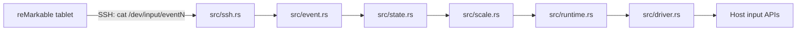

# reMouseable AI Handoff

> [!important] Purpose
> Primary onboarding document for future human or AI agents. Read this note and
> [[reMouseable Rust Migration]] before changing code. Always verify this note
> against current repository state.

## Executive Summary

reMouseable turns a reMarkable tablet stylus into a host-computer mouse. The
Rust application connects to the tablet over SSH, reads a Linux
`/dev/input/event*` stream, decodes fixed-width Evdev records, translates stylus
position and pressure into mouse actions, scales tablet coordinates to the host
display, then injects native host input.

Current targets:

- Windows through Enigo.
- macOS Intel and Apple Silicon through Enigo.
- Linux X11 through Enigo.
- Linux Wayland through a relative `uinput` virtual mouse.

The default launch opens a Slint GUI. `--tui` keeps terminal prompts, diagnostic
output, and local fixture processing available.

## Origins

This repository is a Rust rewrite of Kevin Conway's original
[reMouseable](https://github.com/kevinconway/remouseable) project. Preserve
attribution and GPL-3.0 licensing. Historical Go behavior remains relevant when
explaining compatibility decisions, but the current source tree is Rust.

## Repository Snapshot

| Item | Value |
|---|---|
| Repository root | `C:/Users/mfiner/GIT/remouseable` |
| Main language | Rust 2024 edition |
| UI | Slint |
| SSH | `russh` with Ring backend |
| Host input | Enigo; Linux `uinput` |
| License | GPL-3.0-only |
| Deterministic fixture | `fixtures/representative-events.hex` |
| Integration test | `tests/representative_stream.rs` |

Run these before work:

```shell
git status --short
git log --oneline -10
cargo fmt --check
cargo test --all-targets
cargo clippy --all-targets -- -D warnings
```

On Windows, Cargo linking requires a complete MSVC Build Tools and Windows SDK
environment. A missing `msvcrt.lib` indicates local toolchain configuration,
not necessarily a project code defect.

## Current Capabilities

- Explicit 16-byte little-endian Evdev decoder.
- Local event-file processing with JSON Lines output.
- Named debug-event output.
- Password, prompt, and SSH-agent authentication.
- Optional OpenSSH `known_hosts` verification.
- Remote event-path validation against shell injection.
- Right, left, and vertical coordinate scaling.
- Native hover, left-button press, drag, and release behavior.
- Slint GUI with cooperative stream cancellation.
- Linux Wayland relative `uinput` backend.
- Hyprland focused-monitor logical-size detection.
- Experimental Linux absolute `uinput-tablet` backend.

Validated against real hardware:

- Password SSH and `/dev/input/event1` streaming on June 4, 2026.
- Windows live Enigo pipeline with real stylus events on June 4, 2026.
- Linux Wayland/Hyprland relative `uinput` scaling on June 5, 2026.

Not yet broadly validated:

- SSH-agent authentication against a real tablet.
- macOS native behavior, especially drag semantics.
- Linux X11 real-device behavior.
- Wayland compositors beyond Hyprland.
- Multi-monitor selection and coordinate offsets.
- Windows pen pressure/tilt injection. Current Windows output is mouse input;
  pressure is only a click threshold and tilt is not decoded.

## User-Facing Behavior

GUI launch:

```shell
remouseable
```

Terminal launch:

```shell
remouseable --tui
```

Typical live terminal launch:

```shell
remouseable --tui \
  --ssh-password="TABLET_PASSWORD" \
  --event-file="/dev/input/event1"
```

Local deterministic stream:

```shell
remouseable --tui --input-file=path/to/events.bin
remouseable --tui --input-file=path/to/events.bin --debug-events
```

Stylus behavior:

- Hover moves host cursor.
- Pressure above threshold presses left mouse button.
- Movement while pressed emits drag behavior.
- Pressure below threshold releases left mouse button.

Important flags:

| Flag | Purpose |
|---|---|
| `--tui` | Use terminal mode instead of Slint GUI |
| `--input-file` | Read local raw Evdev stream instead of SSH |
| `--ssh-ip` | Tablet SSH address; default `10.11.99.1:22` |
| `--ssh-user` | SSH user; default `root` |
| `--ssh-password` | Password or `-` for hidden prompt |
| `--ssh-socket` | SSH-agent socket |
| `--ssh-known-hosts` | Enable host-key verification |
| `--event-file` | Remote Evdev path; common default `/dev/input/event1` |
| `--orientation` | `right`, `left`, or `vertical` |
| `--pressure-threshold` | Binary contact threshold; default `1000` |
| `--screen-width`, `--screen-height` | Override display dimensions |
| `--debug-events` | Print selected raw events |
| `--host-driver` | `auto`, `enigo`, `uinput`, or `uinput-tablet` |

## Data Flow



Local `--input-file` streams enter at the parser and emit JSON actions instead
of moving the real cursor.

## Core Architecture

### Entry Point and UI

`src/main.rs` parses CLI arguments and selects GUI or terminal mode.
`src/ui.rs` owns Slint callbacks and runs blocking SSH/native-input work on a
background thread. Stop is cooperative through an atomic cancellation token.

### SSH

`src/ssh.rs` configures `russh`, authenticates, validates the remote event path,
starts `cat <event-file>`, and bridges async SSH chunks into a blocking reader.
It supports password and agent authentication plus optional known-hosts checks.

### Event Parser

`src/event.rs` decodes exactly 16 bytes per tablet event:

```text
u32 seconds
u32 microseconds
u16 event type
u16 event code
i32 value
```

All fields are little-endian. Keep this explicit parser: tablet timestamps use
32-bit fields, while host-native `input_event` layouts may differ.

Current named absolute codes are `ABS_X`, `ABS_Y`, and `ABS_PRESSURE`.

### State Machine

`src/state.rs` stores X/Y, waits for both coordinates before movement, and uses
pressure threshold crossings for click/release. Pressure equal to threshold
causes no transition. Drag mode converts movement to drag while clicked.

### Position Scaling

`src/scale.rs` implements right, left, and vertical mappings. Preserve integer
truncation and orientation behavior unless intentionally changing compatibility.

Default tablet maxima:

```text
height / X maximum: 15725
width / Y maximum: 20967
```

### Runtime and Drivers

`src/runtime.rs` scales state changes and dispatches move, drag, press, and
release operations through the `HostDriver` trait.

`src/driver.rs` contains:

- Enigo absolute mouse driver for Windows, macOS, and Linux X11.
- Linux relative `uinput` mouse driver used by Wayland `auto` mode.
- Experimental Linux absolute `uinput-tablet` driver.

The drivers release a held left button during shutdown.

## Important Files

| Path | Purpose |
|---|---|
| `Cargo.toml` | Rust package and target-specific dependencies |
| `src/main.rs` | CLI and application assembly |
| `src/ui.rs` | Slint frontend |
| `src/ssh.rs` | Live tablet event source |
| `src/event.rs` | Binary event decoding and names |
| `src/state.rs` | Stylus-to-mouse state transitions |
| `src/scale.rs` | Orientation and coordinate scaling |
| `src/runtime.rs` | State-to-driver dispatch |
| `src/driver.rs` | Native host drivers |
| `src/app.rs` | Shared processing pipeline and JSON driver |
| `ui/remouseable.slint` | GUI layout |
| `tests/representative_stream.rs` | End-to-end fixture tests |
| `fixtures/representative-events.hex` | Synthetic deterministic event fixture |

## Testing

```shell
cargo fmt --check
cargo test --all-targets
cargo clippy --all-targets -- -D warnings
cargo test --doc
```

The fixture is synthetic, not a captured real-tablet stream. Native driver tests
can move or click the operator's real cursor; warn before manual injection tests.

## Known Risks and Open Work

1. **SSH host verification is opt-in.** Without `--ssh-known-hosts`, the app
   warns and accepts the host for compatibility. Secure-by-default onboarding
   remains open.
2. **Cross-platform release automation is stale.** GitHub workflows still
   contain obsolete Go jobs and release commands. Replace them with Rust builds
   before relying on CI releases.
3. **Devcontainer is stale.** It still uses a Go image/extensions and must be
   converted before being documented as supported Rust setup.
4. **Multi-monitor behavior is incomplete.** Hyprland uses focused-monitor size,
   but monitor selection and offsets are not general.
5. **Platform acceptance is incomplete.** macOS, Linux X11, and additional
   Wayland compositors need real-device smoke tests.
6. **Windows receives mouse input, not pen input.** Continuous pressure and tilt
   require a Windows synthetic pen driver and richer event/frame domain model.
7. **Dependency security matters.** Keep `Cargo.lock`, review `russh` and input
   crate updates, and run `cargo audit` when available.

## Safe Change Rules

1. Preserve the remote 16-byte event format.
2. Preserve threshold and orientation behavior unless tests define a change.
3. Keep event source, scaler, and host driver behind traits.
4. Keep local fixture processing deterministic and cursor-safe.
5. Treat real-tablet SSH as an acceptance criterion.
6. Validate Windows, macOS, Linux X11, and Linux Wayland independently.
7. Never record tablet passwords in source, fixtures, logs, or notes.
8. Preserve original-project attribution and GPL licensing.

## Agent Startup Checklist

- [ ] Read this note and [[reMouseable Rust Migration]].
- [ ] Run `git status --short`; preserve unrelated user changes.
- [ ] Read `README.md`, `Cargo.toml`, and files relevant to requested work.
- [ ] Inspect recent commits.
- [ ] Run available Rust checks before and after edits.
- [ ] Confirm target platforms and real-tablet availability.
- [ ] Use captured or synthetic 16-byte event fixtures for deterministic tests.
- [ ] Warn before tests that inject real native input.

## Acceptance Criteria

- [x] Password SSH works against tested reMarkable firmware.
- [ ] Agent SSH works against a real tablet.
- [x] Hover, press, drag, and release work on tested Windows host.
- [x] Right, left, and vertical mappings have unit coverage.
- [x] Local stream and debug output have integration coverage.
- [ ] Windows release build and smoke test pass in supported CI/toolchain.
- [ ] macOS Intel/ARM builds and real-device smoke tests pass.
- [ ] Linux X11 build and real-device smoke test pass.
- [x] Linux Wayland/Hyprland basic scaling has real-device validation.
- [ ] Additional Wayland compositor and multi-monitor tests pass.
- [x] Remote event path rejects shell injection.
- [ ] SSH host verification becomes secure by default with usable onboarding.
- [ ] Rust-only CI and release workflows produce supported binaries.

## Related Notes

- [[reMouseable Rust Migration]]
- [[000 - Project Index|Project Index]]

## External References

- [Original reMouseable project](https://github.com/kevinconway/remouseable)
- [Enigo](https://github.com/enigo-rs/enigo)
- [Russh](https://github.com/warp-tech/russh)
- [Rust evdev crate](https://docs.rs/evdev/latest/evdev/)
- [Rust display-info crate](https://docs.rs/crate/display-info/latest)
