# reMouseable AI Handoff

> [!important] Purpose
> This note is primary onboarding document for future human or AI agents. Read it before changing code. Verify assumptions against repository because project may evolve after this note's `updated` date.

## Executive Summary

reMouseable turns a reMarkable tablet stylus into a host-computer mouse. Host application connects to tablet over SSH, runs `cat` against a Linux `/dev/input/event*` device, parses binary Evdev events, translates stylus position and pressure into mouse actions, scales tablet coordinates to host display coordinates, then injects native host mouse events.

Project is discontinued upstream but received a compatibility fix and release workflow updates on September 19, 2024. Current code targets:

- Windows
- macOS Intel and Apple Silicon
- Linux X11

Linux Wayland is not reliably supported.

## Repository Snapshot

| Item | Value |
|---|---|
| Repository root | `C:\Users\mfiner\GIT\remouseable` |
| Default branch | `main` |
| Latest inspected commit | `9ad73bb` |
| Latest inspected commit date | 2024-09-19 |
| Main language | Go 1.23 |
| Native integration | Vendored RobotGo C headers through CGO |
| License | GPL-3.0 |
| CI | GitHub Actions |
| Release targets | Linux, Windows, macOS amd64, macOS arm64 |
| Local Go availability on 2026-06-04 | Not installed |
| Local Rust availability on 2026-06-04 | `rustc 1.94.1`, `cargo 1.94.1` |

Rust conversion status as of June 4, 2026:

- Pure Rust event decoder, filters, state machine, scalers, and runtime implemented.
- Rust CLI implemented with legacy-compatible flags and new `--input-file`.
- Local streams emit scaled mouse actions as JSON Lines or named debug events.
- Live SSH supports password, prompt, default-agent, and custom-agent-socket authentication.
- Rust validates remote event paths and optionally verifies host keys with `--ssh-known-hosts`.
- Ring-backed `russh` password authentication and `/dev/input/event1` streaming were validated against a real tablet on June 4, 2026.
- Live Rust streams inject native host mouse actions through Enigo. Local `--input-file` streams emit JSON actions.
- Real tablet `/dev/input/event1` produced stylus events and ran through Windows native injection without errors on June 4, 2026.
- Live path is optimized for one-read events, zero-copy SSH chunks, one SSH worker, and duplicate-position suppression.

Repository had no uncommitted changes when initially assessed on June 4, 2026. Recheck with `git status --short` before work.

## User-Facing Behavior

Typical run:

```shell
remouseable --ssh-password="TABLET_PASSWORD"
```

reMarkable 2 commonly needs:

```shell
remouseable --ssh-password="TABLET_PASSWORD" --event-file="/dev/input/event1"
```

Stylus behavior:

- Hover moves host cursor.
- Pressure above threshold presses left mouse button.
- Movement while pressed emits drag behavior.
- Pressure below threshold releases left mouse button.

Important flags include:

| Flag | Purpose |
|---|---|
| `--ssh-ip` | Tablet SSH address, default `10.11.99.1:22` |
| `--ssh-user` | SSH user, default `root` |
| `--ssh-password` | Password or `-` for prompt |
| `--ssh-socket` | SSH agent socket |
| `--ssh-known-hosts` | Rust-only optional OpenSSH known-hosts file |
| `--event-file` | Remote Evdev device path |
| `--orientation` | `right`, `left`, or `vertical` |
| `--pressure-threshold` | Click threshold, default `1000` |
| `--screen-width`, `--screen-height` | Override target display size |
| `--tablet-width`, `--tablet-height` | Override tablet coordinate maxima |
| `--debug-events` | Print selected raw events |
| `--disable-drag-event` | Use ordinary movement while pressed |

## Data Flow

```mermaid
flowchart LR
    Tablet["reMarkable Linux tablet"] -->|"SSH: cat /dev/input/eventN"| SSH["SSH stdout stream"]
    SSH --> Parser["FileEvdevIterator"]
    Parser --> Filter["SelectingEvdevIterator: EV_ABS"]
    Filter --> State["Evdev State Machine"]
    State --> Scale["Position Scaler"]
    Scale --> Runtime["Runtime"]
    Runtime --> Driver["RobotgoDriver"]
    Driver --> Host["Host mouse APIs"]
```



## Core Architecture

### Entry Point and SSH

File: `main.go`

Responsibilities:

1. Parse CLI flags using `spf13/pflag`.
2. Get host screen size from `RobotgoDriver`.
3. Configure SSH password or agent authentication.
4. Connect to tablet.
5. Start remote command `cat <event-file>`.
6. Assemble iterator, state machine, scaler, driver, and runtime.
7. Run until event stream ends or an error occurs.

Main entry point has no meaningful automated test coverage.

### Event Parser

Files:

- `pkg/domain.go`
- `pkg/evdeviterator.go`
- `pkg/evdevcodes.go`

Remote wire event layout is exactly 16 bytes:

```text
u32 seconds
u32 microseconds
u16 event type
u16 event code
i32 value
```

All fields use little-endian encoding.

> [!warning] ABI Constraint
> Keep custom 16-byte parser. Tablet emits 32-bit time fields. Host-native Linux `input_event` layouts can use 64-bit time fields and are not guaranteed to match this stream.

`SelectingEvdevIterator` currently retains only `EV_ABS` events. State machine uses:

- `ABS_X`
- `ABS_Y`
- `ABS_PRESSURE`

### State Machine

File: `pkg/statemachine.go`

`EvdevStateMachine`:

- Stores latest X and Y.
- Emits movement only after both X and Y changed.
- Emits click when pressure becomes greater than threshold.
- Emits unclick when pressure becomes less than threshold.

`DraggingEvdevStateMachine` wraps base state machine and converts movement into drag movement while clicked.

Current edge behavior:

- Pressure exactly equal to threshold causes neither transition.
- Events outside `EV_ABS` are ignored.
- X-only or Y-only changes do not emit movement until other coordinate changes.

### Position Scaling

File: `pkg/positionscaler.go`

Default tablet maxima:

```text
height / X maximum: 15725
width / Y maximum: 20967
```

Implementations:

- `RightPositionScaler`: direct proportional mapping.
- `LeftPositionScaler`: flips both axes, then scales.
- `VerticalPositionScaler`: swaps axes, flips one axis, then scales.

Preserve exact integer truncation behavior during ports unless intentionally changing compatibility.

### Runtime

File: `pkg/runtime.go`

Runtime consumes state changes, scales movement coordinates, and calls driver operations:

- Move
- Drag
- Click
- Unclick

First encountered runtime error stops loop and is returned by `Close`.

### Host Driver

Files:

- `pkg/driver.go`
- `pkg/internal/robotgo/`

Only five RobotGo operations are used:

- Get screen size
- Move mouse
- Drag mouse
- Press left button
- Release left button

Vendored RobotGo native code uses:

| Platform | Native mechanism |
|---|---|
| Windows | `SendInput` and `GetSystemMetrics` |
| macOS | Core Graphics `CGEvent` APIs |
| Linux X11 | Xlib and XTest |

Vendored native surface is much larger than actual used feature set.

## Important Files

| Path | Purpose |
|---|---|
| `main.go` | CLI, SSH, dependency wiring, main loop |
| `pkg/domain.go` | Interfaces and state-change domain types |
| `pkg/evdeviterator.go` | Binary event parser and filters |
| `pkg/statemachine.go` | Evdev-to-mouse state transitions |
| `pkg/positionscaler.go` | Orientation and coordinate scaling |
| `pkg/runtime.go` | State-to-driver dispatch |
| `pkg/driver.go` | RobotGo driver adapter |
| `pkg/evdevcodes.go` | Generated Linux event constants and names |
| `pkg/internal/gencodes/main.go` | Evdev code generator |
| `pkg/internal/robotgo/` | Vendored CGO/native host integration |
| `technical-documentation/README.md` | Original detailed design notes |
| `.github/workflows/pr-workflow.yaml` | Tests and cross-platform build checks |
| `.github/workflows/tag-workflow.yaml` | Release builds |
| `.devcontainer/Containerfile` | Linux development dependencies |
| `src/ssh.rs` | Rust live SSH source, authentication, host-key checks |
| `src/main.rs` | Rust CLI and application assembly |
| `src/driver.rs` | Rust Enigo native mouse driver and primary-display detection |

## Testing

Test files:

- `pkg/evdeviterator_test.go`
- `pkg/statemachine_test.go`
- `pkg/positionscaler_test.go`
- `pkg/runtime_test.go`

Generated GoMock files provide interface mocks.

Expected Go commands:

```shell
make test
make lint
make build
```

Direct package test:

```shell
go test ./pkg
```

> [!warning] Local Verification Gap
> Go was not installed during June 4, 2026 assessment, so tests were not run locally. CI installs Linux X11 development packages before build and test.

Native driver tests are difficult because they manipulate actual host mouse. Use unit tests for core logic and explicit manual smoke tests per platform.

Rust validation:

```shell
cargo fmt --check
cargo clippy --all-targets -- -D warnings
cargo test --all-targets
cargo test --doc
```

On the inspected Windows host, Ring-backed `russh` requires a complete MSVC
BuildTools environment. Loading the `14.52.36328` VC include/lib paths and
Windows SDK `10.0.26100.0` allowed all checks to pass. Keep `Cargo.lock`
committed: `russh 0.61.1` currently depends on RustCrypto prereleases, and a
fresh unconstrained resolution can select incompatible `primefield` versions.

## Build and Release

Linux dependencies include:

```text
gcc libc6-dev libx11-dev xorg-dev libxtst-dev
```

Windows builds cross-compile from Linux using MinGW:

```shell
CC=x86_64-w64-mingw32-gcc CGO_ENABLED=1 GOOS=windows go build -o .build/windows.exe main.go
```

macOS builds run on GitHub-hosted macOS runners using latest stable Xcode.

## Known Defects and Security Risks

> [!danger] Fix Before Broad Distribution
> Current behavior contains security and reliability issues. Preserve compatibility only where necessary.

1. **SSH host verification disabled**
   - Location: `main.go`
   - Uses `ssh.InsecureIgnoreHostKey()`.
   - Risk: man-in-the-middle attack.
   - Better design: known-hosts verification with explicit first-use workflow or opt-in insecure flag.
   - Rust preserves this default for launch compatibility, emits a warning, and supports `--ssh-known-hosts`.

2. **Remote command injection through event path**
   - Location: `main.go`
   - Runs `cat %s` with user-controlled `--event-file`.
   - Risk: arbitrary shell command execution as tablet root.
   - Better design: validate event path against strict `/dev/input/event[0-9]+` pattern, safely shell-quote it, or use SFTP/direct channel behavior.
   - Fixed in Rust: only safe absolute event paths are accepted.

3. **Partial-read bug**
   - Location: `pkg/evdeviterator.go`
   - Calls `Read(buf)` once and assumes full 16-byte event.
   - Streams may legally return fewer bytes.
   - Fix: use `io.ReadFull`; Rust equivalent is `read_exact`.

4. **Panics as user-facing error handling**
   - Location: mostly `main.go`
   - Failures produce stack traces instead of actionable messages and stable exit codes.

5. **No main/SSH integration tests**
   - Core logic is tested, but assembly and SSH behavior are not.

6. **Multi-monitor handling incomplete**
   - Screen query may return combined dimensions.
   - No monitor selection or coordinate offset selection.

7. **Wayland unsupported**
   - Current Linux implementation assumes X11.

## Safe Change Rules

1. Preserve remote 16-byte event format.
2. Preserve threshold semantics unless tests and release notes explicitly define a change.
3. Preserve orientation math and integer truncation when porting.
4. Keep host driver behind interface or trait.
5. Do not test native mouse injection without warning operator; tests move/click real cursor.
6. Treat tablet SSH compatibility as real-device acceptance criterion.
7. Validate Windows, macOS, and Linux independently.
8. Do not delete Go implementation until replacement passes captured-stream comparison and real-device smoke tests.

## Recommended Agent Startup Checklist

- [ ] Read this note and [[reMouseable Rust Migration]].
- [ ] Run `git status --short`.
- [ ] Read repository `README.md` and `technical-documentation/README.md`.
- [ ] Inspect latest commits with `git log --oneline -10`.
- [ ] Confirm available Go/Rust toolchains.
- [ ] Run existing tests before edits when Go is available.
- [ ] Identify target platforms and whether real tablet is available.
- [ ] Capture or obtain representative binary Evdev stream for deterministic tests.
- [ ] Keep changes scoped and preserve existing user changes.

## Acceptance Criteria for Any Replacement

- [ ] Password SSH works against supported reMarkable firmware.
- [ ] Agent SSH works where currently supported.
- [ ] Hover moves cursor.
- [ ] Stylus contact presses left button.
- [ ] Movement while pressed drags correctly, especially on macOS.
- [ ] Stylus lift releases button.
- [ ] All three orientations match Go behavior.
- [ ] Debug event output remains useful.
- [ ] Windows build and smoke test pass.
- [ ] macOS Intel and ARM builds pass; macOS smoke test passes.
- [ ] Linux X11 build and smoke test pass.
- [ ] Remote event path cannot inject commands.
- [ ] Host-key behavior is secure by default. Rust behavior is documented but remains insecure by default for Go launch compatibility.

## Related Notes

- [[reMouseable Rust Migration]]
- [[000 - Project Index|Project Index]]

## External References

- [Upstream repository](https://github.com/kevinconway/remouseable)
- [Alternative remarkable_mouse project](https://github.com/Evidlo/remarkable_mouse)
- [Enigo cross-platform input simulation](https://github.com/enigo-rs/enigo)
- [Russh SSH client/server](https://github.com/warp-tech/russh)
- [Rust evdev crate](https://docs.rs/evdev/latest/evdev/)
- [Rust display-info crate](https://docs.rs/crate/display-info/latest)
